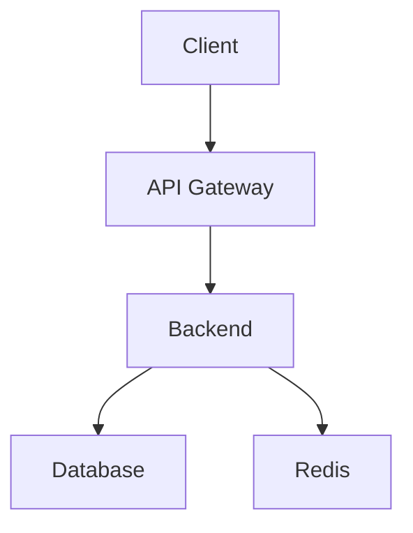
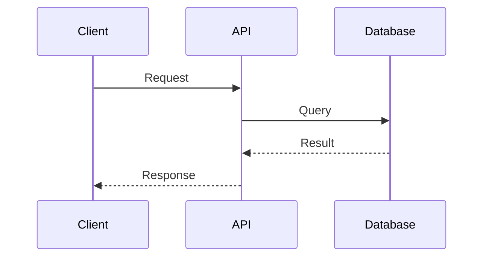

# Documentation Standards — Social Farm AI OS

## Overview

This document outlines the documentation standards for Social Farm AI OS, ensuring consistency and quality across all documentation.

## Documentation Types

### 1. README Files
- **Location:** Root of each package/directory
- **Purpose:** Quick overview and getting started
- **Audience:** New developers, contributors

### 2. Architecture Documents
- **Location:** `docs/` directory
- **Purpose:** System design and technical decisions
- **Audience:** Developers, architects

### 3. API Documentation
- **Location:** `docs/api/` or inline OpenAPI
- **Purpose:** API reference and usage
- **Audience:** API consumers, frontend developers

### 4. User Guides
- **Location:** `docs/guides/`
- **Purpose:** How-to guides and tutorials
- **Audience:** End users, administrators

### 5. Developer Guides
- **Location:** `docs/developer/`
- **Purpose:** Development setup and workflows
- **Audience:** Contributors, team members

## File Structure

### README.md Template

```markdown
# Package Name

Brief description of the package.

## Features

- Feature 1
- Feature 2
- Feature 3

## Installation

```bash
npm install package-name
```

## Usage

```typescript
import { something } from 'package-name';

// Example usage
```

## API Reference

### functionName(param: type): returnType

Description of the function.

**Parameters:**
- `param` (type): Description

**Returns:**
- `returnType`: Description

**Example:**
```typescript
const result = functionName('value');
```

## Configuration

| Option | Type | Default | Description |
|--------|------|---------|-------------|
| option1 | string | 'default' | Description |

## Contributing

See [CONTRIBUTING.md](../CONTRIBUTING.md)

## License

MIT
```

### Architecture Document Template

```markdown
# Architecture: Component Name

## Overview

Brief description of the component.

## Goals

- Goal 1
- Goal 2

## Non-Goals

- Non-goal 1
- Non-goal 2

## Architecture

### High-Level Design

[Diagram or description]

### Components

#### Component 1
- **Purpose:** What it does
- **Interface:** How to use it
- **Implementation:** How it works

### Data Flow

[Description of data flow]

### Error Handling

[Error handling strategy]

## Alternatives Considered

### Alternative 1
- **Pros:** ...
- **Cons:** ...
- **Decision:** Not chosen because...

## Security Considerations

- Security measure 1
- Security measure 2

## Performance Considerations

- Performance consideration 1
- Performance consideration 2

## Monitoring

- Metric 1: Description
- Metric 2: Description

## Future Work

- Future improvement 1
- Future improvement 2
```

### API Documentation Template

```markdown
# API: Endpoint Name

## Overview

Brief description of the endpoint.

## Authentication

Required authentication method.

## Request

### URL

```
POST /api/v1/resource
```

### Headers

```
Content-Type: application/json
Authorization: Bearer <token>
```

### Body

```json
{
  "field1": "value1",
  "field2": "value2"
}
```

### Parameters

| Parameter | Type | Required | Description |
|-----------|------|----------|-------------|
| field1 | string | Yes | Description |
| field2 | number | No | Description |

## Response

### Success (200)

```json
{
  "success": true,
  "data": {
    "id": "123",
    "field1": "value1"
  }
}
```

### Error (400)

```json
{
  "success": false,
  "message": "Validation error",
  "detail": [...]
}
```

## Examples

### cURL

```bash
curl -X POST https://api.example.com/v1/resource \
  -H "Content-Type: application/json" \
  -H "Authorization: Bearer <token>" \
  -d '{"field1": "value1"}'
```

### JavaScript

```javascript
const response = await fetch('/api/v1/resource', {
  method: 'POST',
  headers: {
    'Content-Type': 'application/json',
    'Authorization': `Bearer ${token}`
  },
  body: JSON.stringify({ field1: 'value1' })
});

const data = await response.json();
```

## Rate Limiting

| Limit | Window | Description |
|-------|--------|-------------|
| 100 | 1 minute | Global limit |

## Changelog

| Version | Date | Changes |
|---------|------|---------|
| 1.0.0 | 2026-01-15 | Initial release |
```

## Writing Style

### Tone
- **Professional** but approachable
- **Clear** and concise
- **Active** voice preferred

### Language
- Use **present tense**
- Use **second person** (you)
- Avoid jargon when possible

### Formatting
- Use **headers** for hierarchy
- Use **code blocks** for code
- Use **tables** for structured data
- Use **lists** for multiple items

## Diagram Standards

### Tools
- **Mermaid** for simple diagrams
- **PlantUML** for complex diagrams
- **Draw.io** for architecture diagrams

### Mermaid Examples





## Versioning

### Documentation Versioning
- Follow semantic versioning
- Update changelog with changes
- Archive old versions

### API Documentation
- Version with API
- Maintain backwards compatibility
- Mark deprecations clearly

## Quality Checklist

### Before Publishing

- [ ] Spelling and grammar checked
- [ ] Code examples tested
- [ ] Links verified
- [ ] Formatting consistent
- [ ] Audience appropriate

### Content Quality

- [ ] Accurate information
- [ ] Complete coverage
- [ ] Clear explanations
- [ ] Useful examples
- [ ] Up-to-date

## Maintenance

### Regular Reviews
- **Monthly:** Check for outdated content
- **Quarterly:** Review documentation structure
- **Annually:** Major documentation overhaul

### Ownership
- Each package has documentation owner
- Owner responsible for updates
- Review process for changes

## Tools

### Documentation Generation
- **TypeDoc** for TypeScript API docs
- **Sphinx** for Python docs
- **Storybook** for component docs

### Linting
- **Vale** for prose linting
- **Markdownlint** for Markdown linting
- **alex** for inclusive language

## Resources

- [Google Developer Documentation Style Guide](https://developers.google.com/style)
- [Microsoft Writing Style Guide](https://learn.microsoft.com/en-us/style-guide/)
- [Apple Style Guide](https://developer.apple.com/style/)