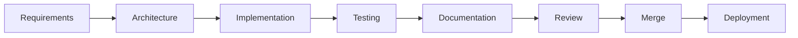

# ENGINEERING PLAYBOOK: Social Farm AI OS

**Version:** 1.0  
**Status:** Active  
**Classification:** Operational Manual  
**Date:** 2026-06-26

---

## 1. Engineering Philosophy
Social Farm AI OS development is governed by the following core tenets, enforced to ensure long-term sustainability:

*   **Documentation-First:** Code implementation shall not commence until the corresponding specification (`docs/specifications/`) is reviewed.
*   **Incremental Implementation:** Features are built in discrete, manageable phases as defined in `docs/IMPLEMENTATION_PLAN.md`.
*   **Vertical Slice Architecture:** Build functional features end-to-end (Database → API → UI) rather than layering horizontally across the entire system.
*   **Simplicity Over Complexity:** Prefer clear, maintainable code over "clever" optimized solutions that introduce cognitive overhead.
*   **AI-Assisted Development:** AI agents are collaborators. Human oversight is mandatory for all architectural, security, and integration decisions.

---

## 2. Repository Workflow
Development follows a rigorous branching strategy based on GitHub Flow.

```mermaid
gitGraph
    branch main
    branch develop
    branch feature/module-x
    checkout feature/module-x
    commit
    commit
    checkout develop
    merge feature/module-x
    checkout main
    merge develop
```

### Conventions
*   **Branches:** `main` (production), `develop` (integration), `feature/<issue-id>-<short-description>`, `hotfix/<issue-id>`.
*   **Pull Requests (PRs):** Mandatory for all merges. Must include a summary, test results, and cross-reference to relevant issues/specs.
*   **Merge Policy:** Requires at least one human review, passing CI pipeline status, and zero open conversations.

---

## 3. Development Lifecycle
Every feature follows the strict lifecycle defined in `MASTER_ORCHESTRATOR.md`:



---

## 4. Coding Workflow (Human + AI)
AI coding agents and human engineers must adhere to clear hand-off protocols:

1.  **Task Decomposition:** Humans define the high-level objective. AI breaks this into actionable tasks.
2.  **Context Management:** AI agent must read relevant specification files and surrounding code before proposing changes.
3.  **Change Isolation:** Changes must be scoped to the specific feature branch.
4.  **Refactoring Policy:** Refactoring is encouraged but must be paired with updated tests and documented in the module's `ADR.md`.

---

## 5. Quality Gates
Mandatory checks required before any PR can be merged to `develop` or `main`:

| Gate | Requirement | Responsible |
| :--- | :--- | :--- |
| **Formatting** | Prettier/Black pass | CI |
| **Linting** | ESLint/Ruff pass | CI |
| **Type Checking** | TypeScript/MyPy pass | CI |
| **Unit Tests** | Coverage > 80% | Developer/CI |
| **Integration** | All scenarios pass | Developer/CI |
| **Accessibility**| Automated audit pass | CI |
| **Security** | No vulnerabilities | CI |
| **Performance** | Meets benchmark | Developer |
| **Docs** | Updated `INDEX.md` | Human Reviewer |

---

## 6. Testing Standards
| Test Type | Objective | Tooling | Coverage Target |
| :--- | :--- | :--- | :--- |
| **Unit** | Isolated logic | Vitest/Pytest | 90% |
| **Integration** | Module interaction | Pytest/HTTPX | 80% |
| **End-to-End** | User journeys | Playwright | Critical Paths |
| **Performance** | Load/Latency | Artillery | Defined Targets |
| **Security** | Vulnerability scan | Bandit/Snyk | 100% |

---

## 7. Documentation Standards
Documentation is a first-class deliverable.
*   **Public APIs:** Must be documented via OpenAPI/Swagger.
*   **Services/Components:** Must include docstrings covering purpose, inputs, outputs, and errors.
*   **ADRs:** Major design decisions must be recorded in the relevant module's `ADR.md`.
*   **Changelogs:** Every release must include an updated `CHANGELOG.md`.

---

## 8. Security Checklist
*   [ ] **Authentication:** JWT implemented; tokens not stored in local storage/client-side logs.
*   [ ] **Authorization:** RBAC enforced; least-privilege principle applied.
*   [ ] **Input Validation:** Zod/Pydantic validation implemented at API/Form boundary.
*   [ ] **Secrets:** No hardcoded secrets; environment variables used exclusively.
*   [ ] **Logging:** Structured logs; no sensitive data logged (PII, tokens).
*   [ ] **Encryption:** TLS in transit; passwords hashed with Argon2.

---

## 9. Performance Checklist
*   [ ] **Database:** Queries optimized; indexes present; no N+1 problems.
*   [ ] **API:** Latency < 500ms for common endpoints.
*   [ ] **Frontend:** Code splitting used; image assets optimized.
*   [ ] **Background Jobs:** Long operations offloaded to Celery workers.
*   [ ] **AI Efficiency:** Caching used for repeated prompts.

---

## 10. AI Development Guidelines
*   **Prompt Documentation:** Use versioned prompts in `docs/prompts/`.
*   **Code Review:** All AI-generated code must undergo a human review equivalent to a junior-to-mid-level developer submission.
*   **Human Approval:** Architectural changes proposed by AI require manual confirmation in the ADR.
*   **Safe Refactoring:** AI must run full test suites before and after refactoring to ensure no regressions.

---

## 11. Release Checklist
*   **Staging:**
    *   [ ] All tests pass.
    *   [ ] Database migrations verified.
    *   [ ] Smoke tests pass in staging environment.
*   **Production:**
    *   [ ] Staging verification complete.
    *   [ ] Backups verified.
    *   [ ] Rollback plan documented.
    *   [ ] Monitoring alerts configured.

---

## 12. Incident Response
1.  **Detection:** Triggered by monitoring/alerts.
2.  **Assessment:** Identify impacted modules and user impact.
3.  **Mitigation:** If production critical, rollback to previous tagged version.
4.  **Root Cause Analysis (RCA):** Conducted post-incident to update `DEVELOPMENT_RULES.md` and prevent recurrence.
5.  **Documentation:** Post-mortem report published.

---

## 13. Continuous Improvement
*   **Retrospectives:** Conducted after every major release milestone.
*   **Technical Debt:** Tracked as "Technical Debt" issues; allocated 20% of sprint capacity.
*   **Architecture Reviews:** Conducted quarterly to ensure the system evolves according to the long-term roadmap.
