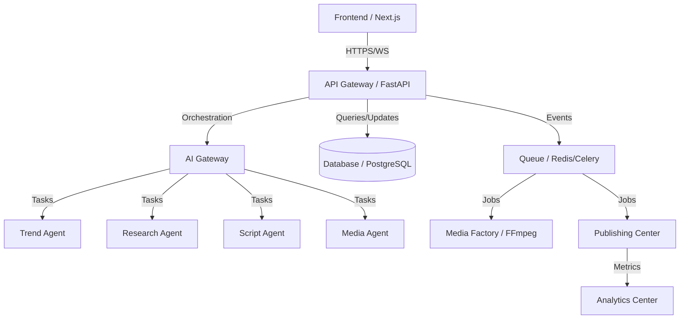

# IMPLEMENTATION PLAN: Social Farm AI OS

**Version:** 1.0  
**Status:** Active  
**Classification:** Engineering Blueprint  
**Date:** 2026-06-26

---

## 1. Executive Summary

### Project Goals
Social Farm AI OS is designed to be the definitive content operations platform. Its goal is to unify the fragmented media creation landscape—from trend discovery to publishing and analytics—into a single, intelligent operating system.

### Architecture Overview
The platform employs a modular, layer-separated architecture. The **Presentation Layer** (Next.js) communicates exclusively with the **API Gateway** (FastAPI), which orchestrates requests across a series of independent **Business Services**, **AI Agents**, and **Infrastructure Layers** (PostgreSQL, Redis, S3). This ensures loose coupling, allowing for independent scaling and maintenance of the trend engine, media processing, and publishing pipelines.

### Development Philosophy
We follow a **"Documentation-first, Specification-driven"** philosophy. Every architectural decision is guided by `MASTER_ORCHESTRATOR.md` and `SYSTEM_ARCHITECTURE.md`. We prioritize maintainability, testability, and security over short-term implementation speed.

### Incremental Implementation Strategy
Development proceeds via a strict **Vertical Slice Strategy**. Instead of building horizontal layers (all DB, then all APIs, then all UI), we implement discrete features (e.g., "AI Script Generation") end-to-end. This enables continuous delivery, immediate testing, and validation of the entire stack at every stage.

---

## 2. Build Strategy

*   **Vertical Slice Development:** Every phase delivers a fully functional slice of the system.
*   **Incremental Architecture:** Core foundation (P1) enables all subsequent phases. Modules are added as plugins/services, avoiding monolithic bloat.
*   **Test-Driven Development (TDD):** Automated tests (Unit, Integration, E2E) are required before a feature is marked as complete.
*   **Documentation-first:** Specifications are refined and agreed upon before implementation.
*   **Feature Isolation:** Modules operate within strict boundaries using defined APIs and event-driven communication.
*   **CI/CD:** Automated pipelines validate every push to `develop` and `main` branches.

---

## 3. Dependency Graph

---

## 4. Development Phases

| Phase | Title | Objectives | Exit Criteria | Complexity |
| :--- | :--- | :--- | :--- | :--- |
| P1 | Foundation | Repo, Auth, Core Arch | Auth operational; Dev env stable | High |
| P2 | Core Platform | DB Schema, Base CRUD | Entities persisted; Migrations stable | High |
| P3 | Dashboard | Base UI, Navigation | Layout responsive; Navigation functional | Medium |
| P4 | Trend Engine | Discovery, Alerts | Real-time trends; Alert triggers active | High |
| P5 | Research | Source connections | Research summaries generated | Medium |
| P6 | AI Studio | Memory, Prompt Library | Context managed; Prompts versioned | High |
| P7 | Script Studio | Scripting pipeline | Scripts approved and stored | High |
| P8 | Media Factory | Rendering, Encoding | Assets generated; Pipelines stable | Very High |
| P9 | Publishing | Queue, Scheduler | Content successfully published | High |
| P10 | Analytics | Dashboards, Metrics | Performance tracked accurately | Medium |
| P11 | Admin | Audit, Security, RBAC | Access controlled; Logs reviewable | Medium |
| P12 | Optimization | Scaling, Caching | Latency reduced; Load targets met | High |

---

## 5. Module Breakdown (Partial)

| Module | Purpose | Responsibilities | Dependencies |
| :--- | :--- | :--- | :--- |
| **AI Studio** | Prompt/Memory orchestration | Prompt routing, context mgmt | AI Gateway, Database |
| **Media Factory** | Multimedia generation | FFmpeg rendering, voice/img gen | Workers, File Storage |
| **Publishing Center** | Multi-platform publishing | Scheduling, platform connectors | Queue, Auth |

*(Note: Full module matrix follows this pattern for all 16 defined modules as per `FILE_STRUCTURE.md`)*

---

## 6. Backend Implementation Order
1. **Infrastructure:** Docker, Database setup.
2. **Auth:** User registration, JWT, RBAC.
3. **Core:** Organizations, Workspaces, Brands.
4. **Data:** Projects, Content metadata, Media metadata.
5. **AI Services:** Gateway, Memory, Prompting.
6. **Workers:** Rendering, Publishing, Analytics aggregation.
7. **APIs:** Domain-specific endpoints.

---

## 7. Frontend Implementation Order
1. **Layouts:** Navigation, Sidebar, Context Panels.
2. **Dashboard:** KPI summary cards, Activity Feed.
3. **Brand/Workspace:** Settings, Context management.
4. **AI Studio:** Prompt editors, Chat interface.
5. **Creation Studio:** Script editor, Asset management.
6. **Media Factory:** Rendering status panels.
7. **Publishing:** Content Calendar, Queue management.
8. **Analytics:** Charts, Reports.

---

## 8. Database Implementation Order
1. **Identity:** `users`, `organizations`, `workspaces`, `brands`.
2. **Content:** `projects`, `content`, `media`, `assets`.
3. **Intelligence:** `ai_memory`, `prompts`.
4. **Operations:** `publishing_jobs`, `analytics`, `audit_logs`.
5. **System:** `indexes`, `migrations`, `cache_metadata`.

---

## 9. AI Implementation Order
1. **Provider Routing:** Centralized `AI_GATEWAY.md` interface.
2. **Memory System:** `MEMORY_SYSTEM.md` persistence.
3. **Prompt Library:** Versioning for `PROMPT_LIBRARY.md`.
4. **Trend/Research:** Agents for data gathering.
5. **Script/Editor:** Agents for language processing.
6. **Media/Thumbnail:** Orchestration agents for media generation.
7. **Analytics/Growth:** Agents for insight generation.

---

## 10. Testing Strategy
*   **Unit:** Python (Pytest) & TypeScript (Vitest) for all business logic.
*   **Integration:** API level testing using `httpx`.
*   **End-to-End (E2E):** Playwright for critical paths (Login -> Trend Discovery -> Publishing).
*   **Performance:** Load testing for the Media Rendering and AI Gateway pipelines.
*   **Security:** Static analysis (Ruff, ESLint) and dependency vulnerability scanning.

---

## 11. Release Strategy
*   **Development:** Merged into `develop`, deployed automatically to dev environment.
*   **Staging:** Merged into `release`, deployed to staging for final QA/UAT.
*   **Production:** Merged into `main`, tagged for release.
*   **Migrations:** Always backwards compatible; executed as part of CI pipeline.

---

## 12. Risk Assessment

| Risk | Impact | Mitigation Strategy |
| :--- | :--- | :--- |
| **AI Cost Escalation** | High | Multi-provider routing; aggressive caching. |
| **Media Bottlenecks** | High | Scalable background workers; job queue prioritization. |
| **Scope Creep** | Medium | Strict roadmap adherence; feature flag enforcement. |
| **API Instability** | High | OpenAPI contract enforcement; strict validation. |

---

## 13. Success Metrics

| Phase | Metric | Goal |
| :--- | :--- | :--- |
| P1 | Auth Latency | < 100ms |
| P3 | Dashboard Load | < 2s |
| P8 | Render Pipeline Success | > 99% |
| P12 | API Error Rate | < 0.1% |

---

## 14. Completion Checklist (Every Phase)
- [ ] Specification reviewed and validated.
- [ ] Backend implementation complete.
- [ ] Frontend implementation complete.
- [ ] Unit & Integration tests passing.
- [ ] Documentation updated in `docs/specifications/`.
- [ ] Performance benchmarks met.
- [ ] Security review conducted.
- [ ] Ready for integration into `develop`.
