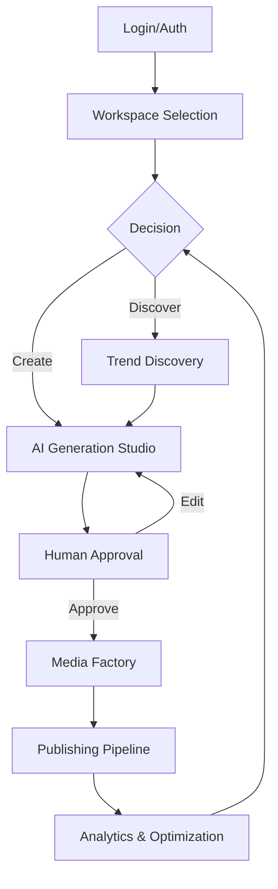

# UI/UX OVERVIEW
Status: Active
Classification: UI/UX Specification

---

## 1. Purpose
This document establishes the foundational User Experience (UX) and User Interface (UI) philosophy for the Social Farm AI Operating System (OS). It serves as the governing blueprint for all visual and interactive components of the platform, ensuring a cohesive, professional, and highly efficient workflow for enterprise-level content operations. All subsequent UI specifications (Dashboard, Media Factory, AI Studio, etc.) must adhere to the principles, interaction patterns, and design language defined herein.

---

## 2. Product Experience Vision
Social Farm AI OS is not merely a tool; it is a **Command Center** for modern media production.

### The Media Company Metaphor
The platform operates on a "digital media company" metaphor. The user functions as the **Chief Executive Officer (CEO)**, providing strategic direction, approval, and oversight, while the integrated AI agents function as specialized departments (Research, Scripting, Media, Analytics).

### Command Center Philosophy
The UX must project control, clarity, and capability. The environment is designed for professional and enterprise users who require:
*   **High-Volume Production:** Ability to manage hundreds of content assets simultaneously.
*   **Workflow Integration:** Seamless transitions between research, creation, and publication.
*   **AI Coordination:** Intuitive management of autonomous or semi-autonomous AI agents.

---

## 3. UX Philosophy
The user experience is built on trust, efficiency, and predictability.

| Principle | Explanation |
| :--- | :--- |
| **Simplicity** | Reduce noise. Every UI element must serve a clear purpose or be removed. |
| **Discoverability** | Intuitive navigation and clear affordances. Users should never feel "lost." |
| **Feedback** | Immediate response to every interaction (visual, auditory, or haptic). |
| **Predictability** | Consistent patterns for actions (e.g., primary buttons always perform the main action). |
| **Consistency** | Standardized design language across all modules. |
| **Learnability** | High initial usability, with advanced shortcuts for power users. |
| **Trust** | AI actions must be transparent, reversible, and auditable. |

---

## 4. Design Principles
1.  **Visual Hierarchy:** Use size, color, and spacing to draw attention to critical tasks first.
2.  **Progressive Disclosure:** Present complexity only when needed. Start with core functionality, expose advanced controls on demand.
3.  **Context Awareness:** UI adapts based on the user's current project, brand, or content stage.
4.  **Efficiency:** Optimize for "power users." Minimize clicks; emphasize keyboard navigation and command palettes.
5.  **Accessibility:** Built for everyone. WCAG AA compliance is a baseline.
6.  **Human-in-the-loop:** All automated actions, especially publishing, require explicit human confirmation.

---

## 5. Primary User Types

| User Type | Goals | Pain Points | Workflow |
| :--- | :--- | :--- | :--- |
| **Creator** | Rapid, high-quality output | Fatigue, creative block | Fast-paced, iterative |
| **Agency** | Multi-brand management | Switching context, organization | High-volume, structured |
| **Enterprise** | Brand consistency, ROI | Compliance, scale | Strategic, collaborative |

---

## 6. Primary User Journey

---

## 7. Navigation Philosophy
Navigation is structured for rapid context switching:
*   **Primary Sidebar:** Global navigation between major modules (Dashboard, AI Studio, Media Factory, Analytics).
*   **Context Panel:** Nested navigation specific to the current module (e.g., project list in AI Studio).
*   **Command Palette:** The primary interaction method for power users (CMD+K). Enables searching anything, executing quick actions, and jumping between projects.

---

## 8. Information Architecture
The platform organizes information by:
1.  **Organizations** (Global root)
2.  **Workspaces** (Functional or client-based containers)
3.  **Brands** (Identity and style management)
4.  **Projects** (Campaign-level containers)
5.  **Assets/Scripts/Media** (Resource-level)

---

## 9. Workspace Philosophy
Workspaces provide logical isolation.
*   **Orgs:** Own billing, permissions, and global settings.
*   **Brands:** Own assets, style guides, and publishing integrations.
*   **Permissions:** Granular access controls (RBAC) ensure users only see and interact with what is authorized.

---

## 10. AI Experience
AI is **embedded**, not segregated.
*   **Context-aware:** The AI knows the current project, brand guidelines, and history.
*   **Inline:** AI assistance is available in text editors, media panels, and search fields.
*   **Global AI:** A dedicated AI Assistant for complex orchestration and cross-module tasks.
*   **Human Approval:** All high-impact AI actions (publishing, modifying brand assets) require a "Confirm/Edit" step.

---

## 11. Dashboard Philosophy
The dashboard is the user's "control room."
*   **KPIs:** Instant visibility into performance metrics.
*   **Attention Management:** Highlight actions requiring immediate human intervention (e.g., "3 scripts awaiting approval").
*   **Priorities:** AI-curated list of recommended actions.

---

## 12. Interaction Design
Interactions focus on clarity and speed.
*   **Animations:** Purposeful, providing feedback for state changes (e.g., panel opening).
*   **Undo:** Global undo/redo functionality is mandatory for all user-editable content.
*   **Confirmation:** Required for destructive actions.

---

## 13. Visual Hierarchy
The UI uses typography, spacing, and color to differentiate:
*   **Primary Actions:** Highly visible (e.g., filled brand color buttons).
*   **Secondary Actions:** Outlined or subtle buttons.
*   **Cards:** Used for organizing content, assets, and KPIs.

---

## 14. Accessibility
Accessibility is a first-class citizen.
*   **WCAG AA Compliance:** Mandatory for all components.
*   **Keyboard Navigation:** All functionality must be keyboard-accessible.
*   **Screen Readers:** Proper labeling (ARIA) and logical DOM structure.

---

## 15. Responsive Design
The platform provides a unified OS experience, gracefully scaling from TV Dashboards (monitoring) to Laptops (creation) to Tablets/Phones (review/approval). The core UI language remains consistent regardless of the device.

---

## 16. Performance UX
The UI must feel instantaneous even when processes are slow.
*   **Skeletons:** Used for loading states.
*   **Streaming:** AI output streams in real-time.
*   **Optimistic UI:** Perform the action in the UI immediately, sync with the backend in the background.

---

## 17. Motion Philosophy
Motion is used to explain state, not for decoration.
*   **Micro-animations:** 100-200ms duration for panel transitions, button feedback.
*   **AI thinking:** Subtle pulse animations to indicate the AI is processing.

---

## 18. Error UX
Errors must be informative and actionable.
*   **Recovery:** Never just show "Error." Show "Error [code]. Here is how to fix it."
*   **Offline Mode:** Graceful degradation when connectivity is lost.

---

## 19. Future UX
Future development paths include:
*   **Voice Control:** Full hands-free orchestration.
*   **Desktop App:** Deep OS integration for better media handling.
*   **Multi-Monitor:** Detachable panels for pro-workflows.

---

## 20. Relationship to UI Modules
This document is the "Constitution" of Social Farm AI OS.
*   **Dashboard** follows the "Attention Management" section.
*   **Media Factory** follows the "Performance UX" and "Interaction Design" sections.
*   **AI Studio** follows the "AI Experience" section.
*   **Navigation** within all modules must follow the "Navigation Philosophy" section.

---

*This document is the authoritative source for all UI/UX decisions within Social Farm AI OS.*
