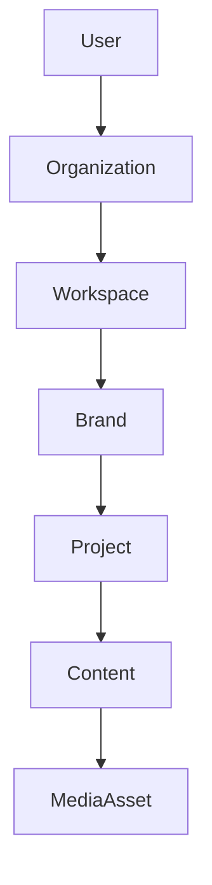

# DATABASE OVERVIEW

## Purpose
This document outlines the architectural philosophy for the Social Farm AI OS PostgreSQL database.

## Database Philosophy
The database is designed to be the robust foundation for high-concurrency content operations. 
1. **Source of Truth:** All persistent state is in PostgreSQL.
2. **Hybrid Modeling:** Relational structures (3NF) for transactional data (Users, Auth, Projects), JSONB for flexible data (AI context, Trend results, Analytics metadata).
3. **Consistency:** Enforced via constraints, foreign keys, and application-level validation.

## Schema Organization
The schema is logically divided into domain-specific schemas:
- `core`: Identity, Auth, Organization, Workspace, Brand, Project.
- `content`: Content, Scripts, Media, Assets, Tags.
- `ai`: Prompts, Memory, Conversations, Agents.
- `ops`: Publishing, Analytics, Notifications, Audit Logs.

## Normalization Strategy
Entities are normalized to 3NF to ensure data integrity and prevent update anomalies, while using JSONB columns in specific tables (e.g., `ai_memory`, `analytics_payload`) to allow schema-less data evolution.

## Naming Conventions
- **Tables:** `snake_case`, pluralized (e.g., `organizations`, `projects`).
- **Columns:** `snake_case`.
- **Primary Keys:** UUID v4/v7.
- **Audit Columns:** Every table must have `created_at`, `updated_at`, `deleted_at`.

## Partitioning Strategy
Table partitioning is employed for high-volume operational data (e.g., `audit_logs`, `analytics_events`) based on `created_at` ranges.

## Future Scalability
- Read/Write splitting for database operations.
- Connection pooling via PgBouncer.
- Geographical read-replicas for multi-region performance.

