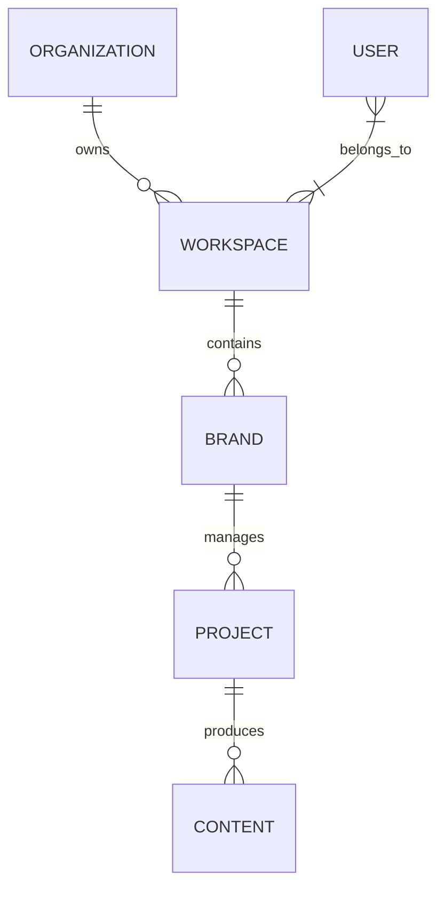

# ENTITY RELATIONSHIPS

## Overview
Social Farm AI OS utilizes a relational architecture with explicit junction tables for Many-to-Many relationships and foreign key constraints for One-to-Many relationships.

## Relationship Principles
- **Ownership:** Foreign keys explicitly link child records to parents (e.g., `projects.brand_id`).
- **Cascade Rules:** 
    - `DELETE SET NULL` for shared assets.
    - `DELETE CASCADE` for domain ownership (e.g., deleting a project deletes associated content).
    - `UPDATE CASCADE` for primary key changes (rare with UUIDs).

## ER Diagram (Core Entities)

## Detailed Relationship Rules
- **Organizations -> Workspaces:** One-to-Many. `workspace.organization_id` (FK, NOT NULL).
- **Users -> Workspaces (Membership):** Many-to-Many. `workspace_members` junction table (user_id, workspace_id, role_id).
- **Brands -> Projects:** One-to-Many. `project.brand_id` (FK, NOT NULL).
- **Projects -> Content:** One-to-Many. `content.project_id` (FK).
- **Content -> Media:** One-to-One. `media_asset.content_id` (FK).

## Junction Tables
- `workspace_members`: User <-> Workspace membership + role.
- `project_tags`: Content <-> Tags Many-to-Many.
- `brand_integrations`: Brand <-> Platform connectors.
