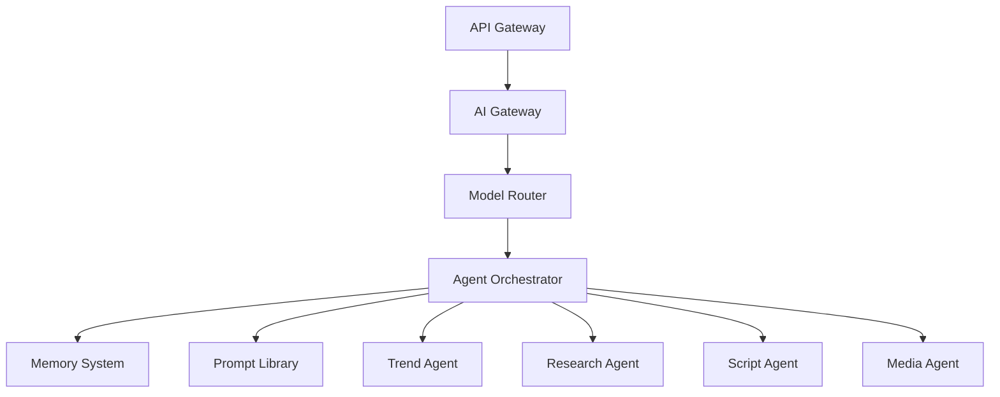

# AI Architecture Specification

## 1. Overview
The Social Farm AI OS utilizes a multi-agent architecture to orchestrate complex content operations. The AI system is designed to be modular, scalable, and provider-agnostic.

## 2. Architecture Diagram

## 3. Core Components
*   **AI Gateway**: Centralized interface for all AI requests, handling authentication, rate limiting, and logging.
*   **Model Router**: Dynamically routes requests to the most cost-effective and capable model provider (e.g., OpenAI, Anthropic, Local LLMs).
*   **Agent Orchestrator**: Manages the lifecycle and interaction of specialized AI agents.
*   **Memory System**: Provides long-term and short-term context for agents.
*   **Prompt Library**: Version-controlled repository of optimized prompts.

## 4. Design Principles
*   **Provider Agnostic**: Easily switch between model providers.
*   **Context-Aware**: Agents have access to relevant project and brand context.
*   **Scalable**: Agents run as independent, asynchronous tasks.
*   **Secure**: All prompts and data are sanitized and logged for audit.
