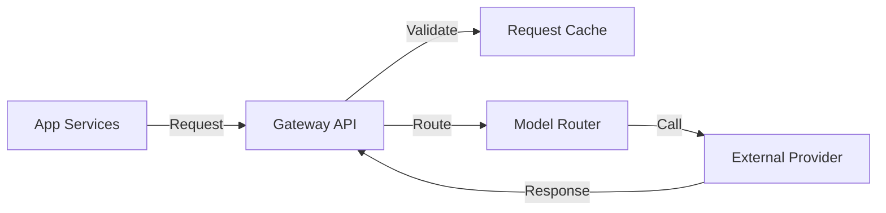

# AI System: AI_GATEWAY

## Purpose
The AI Gateway acts as the sole interface between the application and external AI providers. It abstracts provider-specific implementations, standardizes requests/responses, manages costs, and handles service resilience.

## Responsibilities
- **Registry:** Manages dynamic provider/model configurations.
- **Normalization:** Standardizes diverse provider responses into internal schema.
- **Resilience:** Implements retries, timeouts, and automatic circuit breaking.
- **Observability:** Tracks token usage, latency, and costs per provider.

## Architecture

## Security
- API keys stored in encrypted secrets vault.
- Request filtering for sensitive information.
- Provider isolation to prevent cross-vendor leakages.

| Feature | Implementation Detail |
| :--- | :--- |
| **Authentication** | Per-provider credential management |
| **Retry Logic** | Exponential backoff |
| **Streaming** | Native support for SSE |
| **Cost Tracking** | Real-time logging to Redis |
