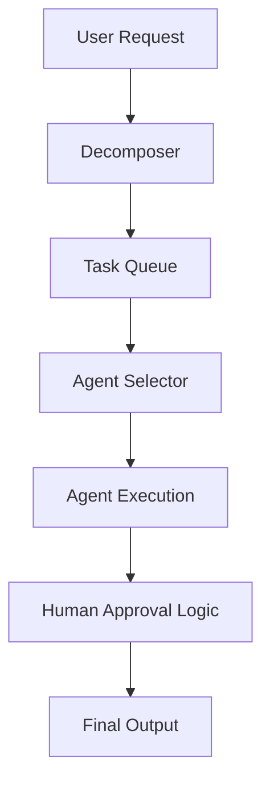

# AI System: AI_ORCHESTRATOR

## Purpose
The AI Orchestrator is the central brain of the platform. It manages task decomposition, agent assignment, state persistence, and human-in-the-loop approvals.

## Responsibilities
- **Task Decomposition:** Breaks complex user requests into atomic agent tasks.
- **Agent Lifecycle:** Manages agent initialization, state, and destruction.
- **Workflow State:** Maintains the progress of multi-step autonomous workflows.
- **Human Hand-off:** Routes tasks to human review when confidence scores are low.

## Architecture

## Security
- Validates the user's authority to trigger workflows.
- Audit logs every decision made by the orchestrator.
