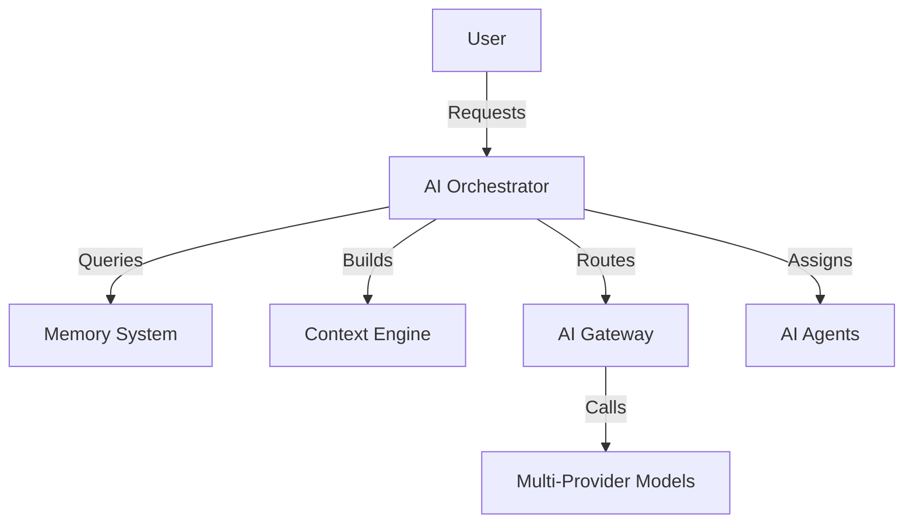

# AI System: AI_OVERVIEW

## Purpose
The AI System is the functional core of Social Farm AI OS. It transforms raw data into high-quality multimedia content through orchestrated AI agents.

## Responsibilities
- Centralized model abstraction and orchestration.
- Autonomous workflow execution.
- Context-aware content generation.
- Real-time trend intelligence.

## Architecture
The system employs a decentralized agent model coordinated by a central orchestrator. 

## Philosophy
The AI system is **Provider-Agnostic**. No specific model (OpenAI, Gemini, Grok) is hardcoded into application business logic. All interactions pass through the `AI_GATEWAY.md` to ensure modularity, cost-optimization, and fallback resilience.

## Interaction Lifecycle
1. **Request:** User or system initiates a task.
2. **Orchestration:** Orchestrator retrieves relevant context/memory.
3. **Routing:** Gateway selects the optimal model based on cost, quality, and latency requirements.
4. **Execution:** Agent executes task.
5. **Validation:** System validates output against schema/requirements.
6. **Delivery:** Result returned to the application.
