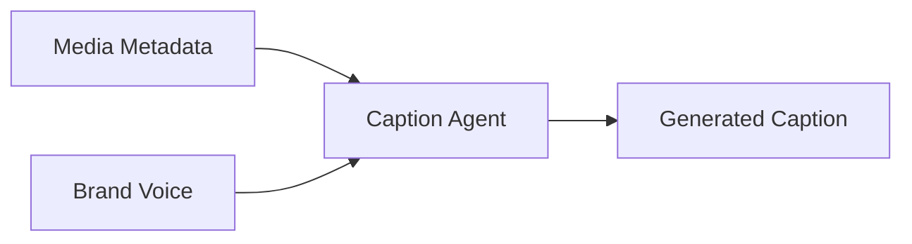

# Caption Agent Specification

## 1. Purpose
The Caption Agent generates platform-optimized captions for media assets.

## 2. Responsibilities
*   Generate engaging captions based on media content and brand voice.
*   Optimize captions for specific platforms (e.g., Instagram, TikTok, LinkedIn).
*   Incorporate relevant hashtags and calls-to-action (CTAs).

## 3. Workflow

## 4. Configuration
*   **Max Length**: Configurable per platform.
*   **Tone**: Configurable based on brand guidelines.
*   **Hashtag Density**: Configurable.

## 5. Integration
*   **Input**: Media metadata, Brand voice profile.
*   **Output**: Optimized caption string.
