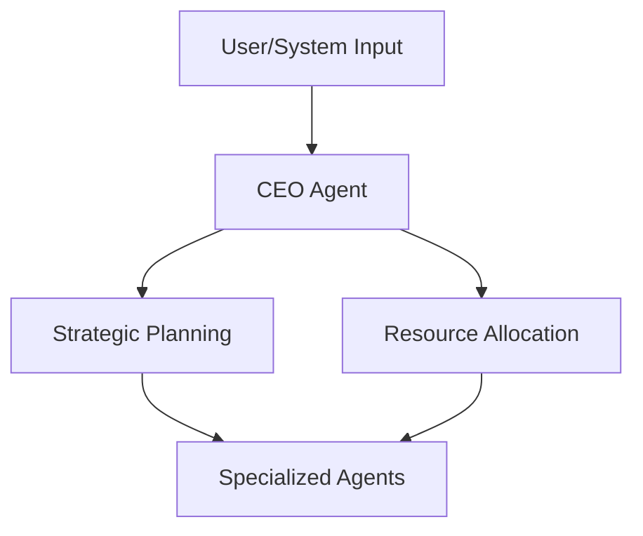

# CEO Agent Specification

## 1. Purpose
The CEO Agent acts as the high-level orchestrator for the Social Farm AI OS, managing overall project goals, resource allocation, and strategic decision-making.

## 2. Responsibilities
*   Analyze project roadmap and progress.
*   Prioritize tasks based on business goals.
*   Allocate AI resources to specialized agents.
*   Provide high-level status reports.

## 3. Workflow

## 4. Decision Logic
The CEO Agent uses a weighted scoring system based on:
*   Project Priority
*   Resource Availability
*   Cost Constraints
*   Deadline Urgency

## 5. Integration
*   **Input**: Project roadmap, system status, user objectives.
*   **Output**: Strategic directives and task assignments for other agents.
