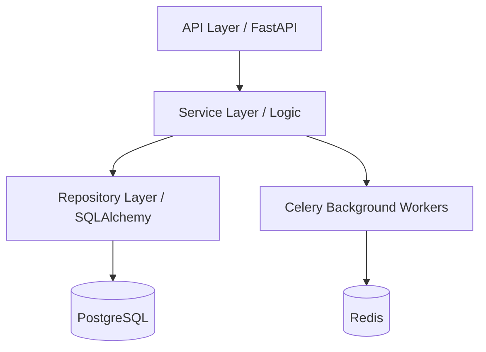

# BACKEND OVERVIEW

## Purpose
This document establishes the architectural blueprint for the Social Farm AI backend.

## Backend Philosophy
- **Layered Architecture:** Strict separation between API (FastAPI), Business Logic (Services), and Data Access (Repositories).
- **Domain-Driven:** Modules encapsulate specific domain logic to ensure maintainability.
- **Async-First:** Heavy reliance on `asyncio` for high-throughput I/O.
- **Event-Driven:** Asynchronous communication between modules via Redis/Celery.

## Architecture Layers

## Request Lifecycle
1. **API:** Request received, validated by Pydantic.
2. **Controller:** Auth check, request mapped to Service.
3. **Service:** Business rules executed, Repo called.
4. **Repository:** Database query, data returned.
5. **Response:** Controller formats response, returned to user.
