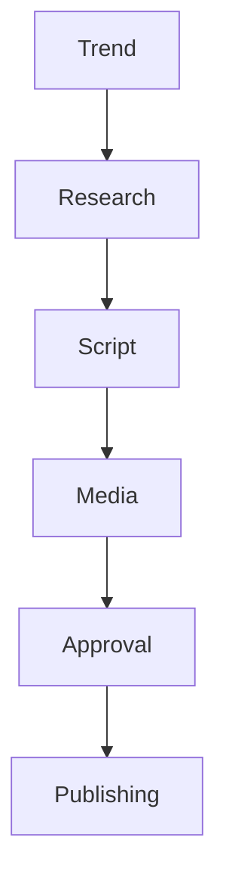

# WORKFLOW ENGINE

## Purpose
Orchestrates complex multi-stage workflows.

## Workflow Example (Content Creation)

```mermaid
graph TD
    Trend --> Research
    Research --> Script
    Script --> Media
    Media --> Approval
    Approval --> Publishing
```
- Orchestrates between services using event emitters and workers.
