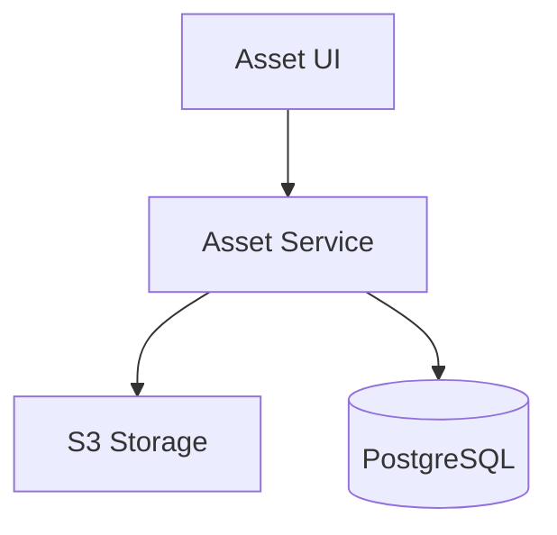

# Frontend Specification: ASSET_LIBRARY_UI

## Purpose
A centralized repository for managing all brand assets (Images, Videos, Voice, Documents).

## Responsibilities
- Folder-based asset organization.
- Advanced search and metadata-based filtering.
- Bulk actions (move, delete, tag).
- Asset metadata editing.

## Architecture
- Virtualized list for efficient rendering of large libraries.
- Drag-and-drop file upload integration.

## Inputs/Outputs
- **Inputs:** File uploads, search queries.
- **Outputs:** Asset URLs, metadata objects.

## Mermaid Diagram

| Action | Interaction | Loading | Accessibility |
| :--- | :--- | :--- | :--- |
| **Search** | Typeahead | Debounce spinner | ARIA live region |
| **Bulk Edit** | Checkbox select | None | Keyboard focus management |
