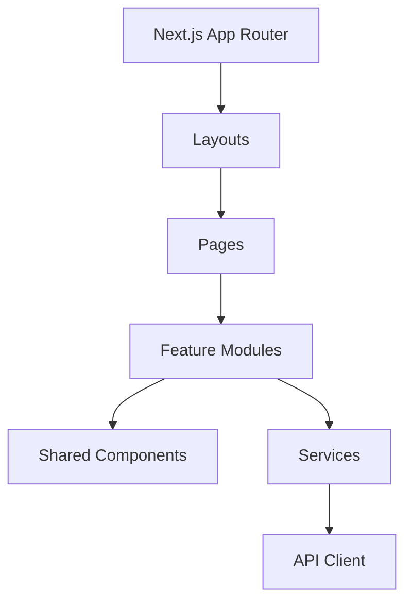

# Frontend Specification: FRONTEND_OVERVIEW

## Philosophy
The frontend follows a "Feature-First" modular architecture within a Next.js App Router paradigm. 

## Architectural Pillars
1. **Separation of Concerns:** UI (Components) is strictly separated from Business Logic (Services/Hooks).
2. **Performance:** Prioritize Server Components for static/lightweight UI, Client Components for interactivity.
3. **Consistency:** Enforced via shadcn/ui and centralized design tokens (Tailwind).

## High-Level Architecture

