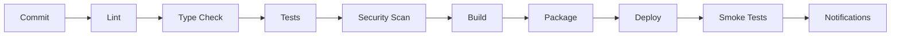

# CI/CD Pipeline Specification

## 1. Pipeline Overview
The Social Farm AI OS CI/CD pipeline is designed for speed, reliability, and security. It is fully automated using GitHub Actions.

## 2. Pipeline Stages

| Stage | Description | Tools |
| :--- | :--- | :--- |
| **Lint** | Enforce code style and best practices. | ESLint, Flake8, Prettier |
| **Type Check** | Static type analysis to catch errors early. | TypeScript, MyPy |
| **Tests** | Unit, integration, and E2E tests. | Jest, PyTest, Playwright |
| **Security Scan** | Dependency scanning and container vulnerability analysis. | Snyk, Trivy |
| **Build** | Create optimized container images. | Docker |
| **Package** | Push images to container registry. | GitHub Container Registry |
| **Deploy** | Deploy to target environment. | GitHub Actions, Helm/K8s |
| **Smoke Tests** | Verify basic functionality post-deployment. | Custom Scripts |
| **Rollback** | Automated rollback on failure. | GitHub Actions |
| **Notifications** | Slack/Email alerts on pipeline status. | Slack API, Email |

## 3. Pipeline Logic
*   **Fail Fast**: The pipeline stops immediately if any stage fails.
*   **Caching**: Dependencies are cached to speed up build times.
*   **Parallelization**: Independent tests run in parallel.
*   **Environment-Specific**: Different configurations and deployment targets for each environment.
*   **Approval Gates**: Production deployments require manual approval from authorized personnel.
