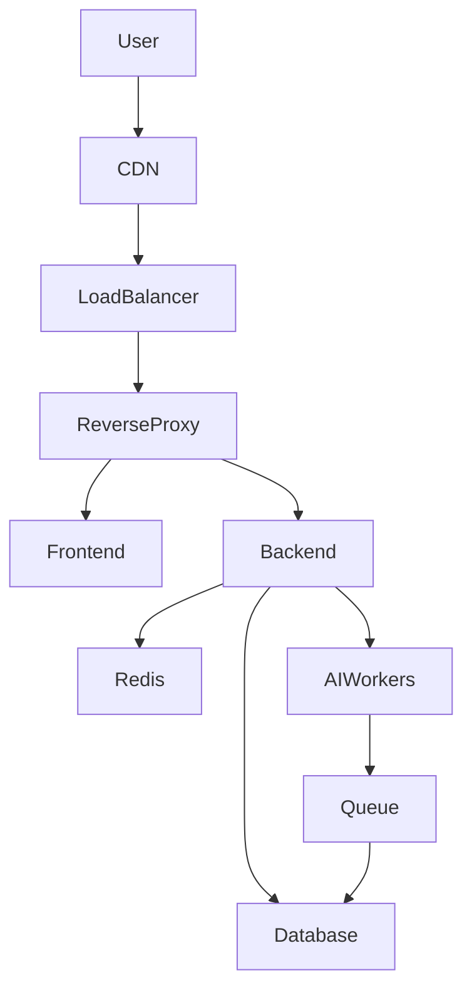

# Infrastructure Specification

## 1. Deployment Targets
Social Farm AI OS is designed to be platform-agnostic, supporting various deployment targets:

| Target | Use Case | Characteristics |
| :--- | :--- | :--- |
| **Local** | Development, Testing | Docker Desktop, Minikube |
| **VPS** | Small-scale Production | Managed VPS, Docker Swarm |
| **Cloud** | Large-scale Production | AWS/GCP/Azure, Managed K8s (EKS/GKE/AKS) |
| **Future** | Future-proofing | Kubernetes-ready architecture |

## 2. Architecture Diagram

## 3. Infrastructure-as-Code (IaC)
All infrastructure is provisioned and managed using IaC tools (e.g., Terraform or Pulumi). This ensures:
*   **Reproducibility**: Infrastructure can be recreated in any region or cloud provider.
*   **Version Control**: Infrastructure changes are tracked in Git.
*   **Automation**: Infrastructure provisioning is integrated into the CI/CD pipeline.

## 4. Scalability & High Availability
*   **Horizontal Scaling**: All services are designed to scale horizontally based on traffic demand.
*   **Redundancy**: Multi-AZ (Availability Zone) deployment for all critical services to ensure high availability.
*   **Failover**: Automated failover mechanisms for databases and load balancers.
