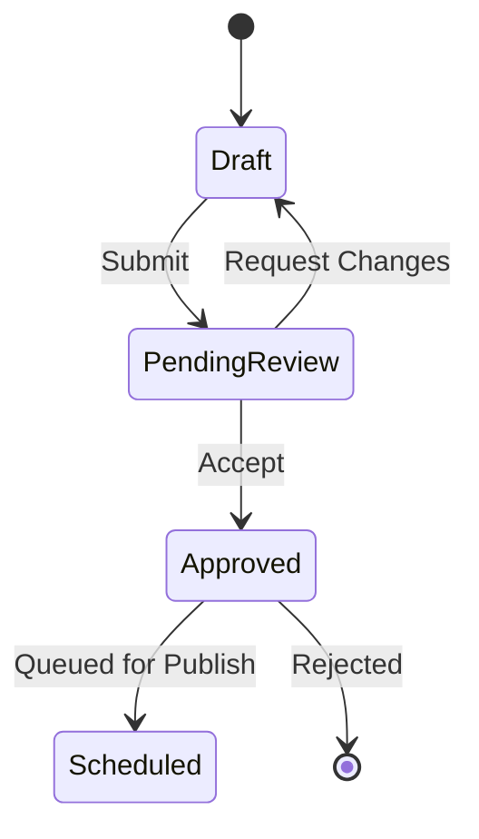

# APPROVAL_WORKFLOW

## Purpose
The Approval Workflow ensures that all content undergoes mandatory human verification before it reaches the publishing phase, maintaining brand integrity and compliance.

## Workflow

## Responsibilities
- **Role Permissions:** Defining who can draft, review, and approve content (e.g., Content Creator, Brand Manager).
- **Audit Trail:** Maintaining a timestamped log of all review actions, comments, and approval status changes.
- **Revision Tracking:** Allowing creators to view reviewer feedback and modify drafts accordingly.

## Audit Logging
Every status change in the approval process is persisted in an audit log with the following fields:
- `timestamp`
- `user_id`
- `action` (Submit, Approve, Reject, Request Changes)
- `comment` (optional)
- `post_id`
