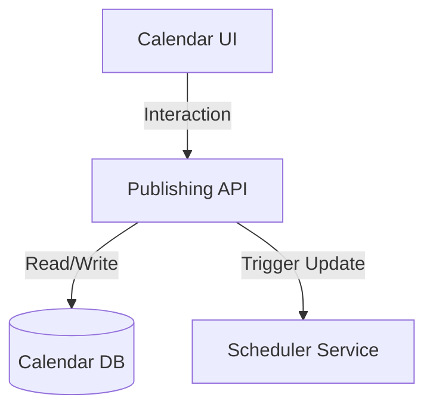

# CALENDAR_SYSTEM

## Purpose
The Calendar System provides a centralized interface for users to visualize, plan, and manage their content distribution schedule.

## Key Features
- **Visual Timeline:** Weekly, monthly, and list views.
- **Drag-and-Drop:** Easy rescheduling of content.
- **Campaign Management:** View and manage multi-post campaigns.
- **Bulk Scheduling:** Ability to upload and schedule large volumes of content simultaneously.
- **Platform Filtering:** Filter by platform, status, or workspace.

## Workflow

## Data Model
The Calendar DB stores post schedules with `post_id`, `scheduled_at` (UTC), `platform`, `status`, and `campaign_id`.
