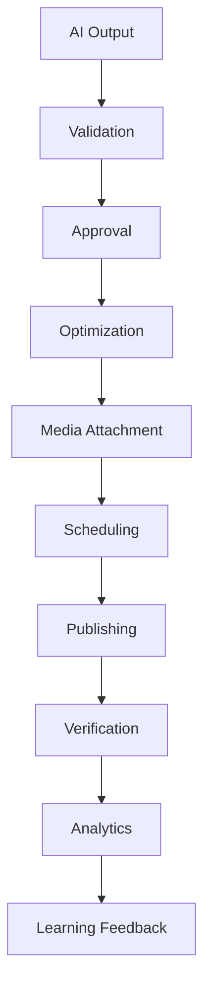

# CONTENT_PIPELINE

## Purpose
The Content Pipeline defines the end-to-end transformation and progression of content from initial generation to successful publication on target social platforms.

## Pipeline Workflow

## Pipeline Stages
1. **AI Output:** Raw content generated by AI agents (text, media).
2. **Validation:** Checking constraints (e.g., character limits, media format suitability).
3. **Approval:** Human review and sign-off.
4. **Optimization:** Refining content (hashtags, formatting) for specific platforms.
5. **Media Attachment:** Associating optimized media with the post payload.
6. **Scheduling:** Assigning time slot and placement.
7. **Publishing:** API invocation via `PLATFORM_CONNECTORS`.
8. **Verification:** Confirming API success and platform rendering.
9. **Analytics:** Collecting initial post performance metrics.
10. **Learning Feedback:** Updating AI models based on post performance.

## Dependencies
- **AI Agents:** For content generation and optimization.
- **PublishingEngine:** For scheduling and dispatching.
- **AnalyticsCenter:** For performance monitoring.

## Performance Considerations
- **Non-blocking:** Stages that allow it (like Analytics, Learning Feedback) run asynchronously.
- **Validation:** Occurs early in the pipeline to prevent unnecessary downstream processing.
