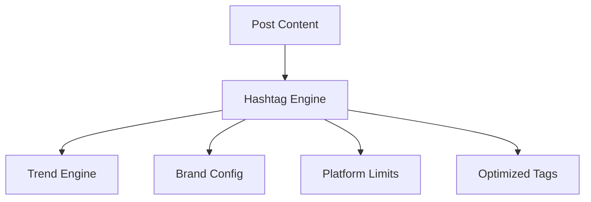

# HASHTAG_ENGINE

## Purpose
The Hashtag Engine dynamically manages, suggests, and optimizes hashtags for content to maximize reach and visibility across platforms.

## Key Features
- **AI Suggestions:** Analyzes post content to suggest relevant, high-performing hashtags.
- **Trending Integration:** Pulls real-time trends from the `TrendEngine` for timely content.
- **Brand Management:** Stores and enforces usage of required brand/campaign hashtags.
- **Platform Adaptation:** Filters hashtags based on platform-specific constraints (e.g., number of tags, forbidden tags).

## Workflow

