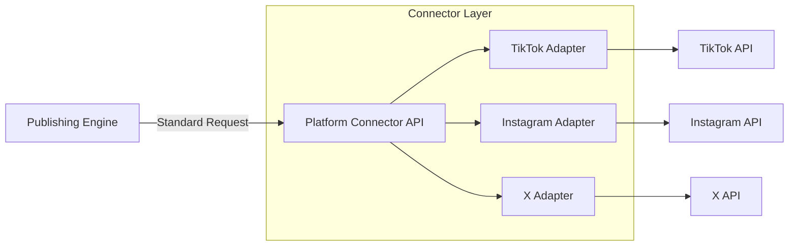

# PLATFORM_CONNECTORS

## Purpose
The Platform Connector layer acts as a standardized interface for interacting with various social media platform APIs, shielding the `PublishingEngine` from platform-specific complexities.

## Responsibilities
- **Authentication:** Managing OAuth flows and token refreshing.
- **Normalization:** Converting internal post formats into platform-specific API payloads.
- **Request Execution:** Invoking platform APIs with proper rate limiting.
- **Response Parsing:** Interpreting platform responses (success, error, rate limit).
- **Retry Management:** Handling transient platform-specific failures (429, 5xx).

## Architecture

## Supported Platforms
| Platform | Auth Type | Supported Media | Post Types |
| :--- | :--- | :--- | :--- |
| TikTok | OAuth 2.0 | Video | Post, Story |
| Instagram | OAuth 2.0 | Image, Video | Post, Reel, Story |
| Facebook | OAuth 2.0 | Image, Video, Text | Post, Reel |
| X | OAuth 1.0a/2.0 | Image, Video, Text | Tweet, Thread |
| YouTube | OAuth 2.0 | Video | Video, Short |
| LinkedIn | OAuth 2.0 | Image, Video, Text | Post |
| Pinterest | OAuth 2.0 | Image, Video | Pin |
| Threads | OAuth 2.0 | Image, Video, Text | Thread |

## Error Handling
Each connector implements a standardized error-handling strategy that maps platform-specific error codes into the system's `InternalErrorCode` (e.g., `AUTH_EXPIRED`, `RATE_LIMIT_EXCEEDED`, `INVALID_MEDIA`).

## Security Considerations
- **Token Handling:** Connectors fetch tokens from the secure vault.
- **Isolation:** Connectors run in isolated execution contexts to prevent cross-contamination of credentials.
