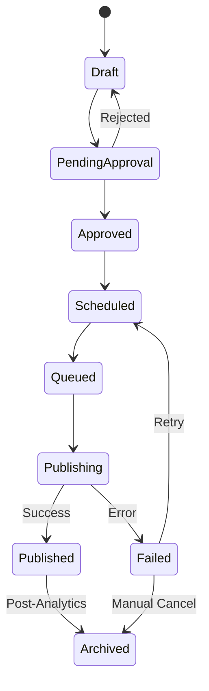

# POST_LIFECYCLE

## Purpose
This document defines the strict state machine that governs a post from creation to archival, ensuring data consistency and clear reporting.

## State Machine

## State Definitions
- **Draft:** Initial creation.
- **PendingApproval:** Awaiting human review.
- **Approved:** Validated and ready.
- **Scheduled:** Placed in the calendar.
- **Queued:** Ready for immediate publishing.
- **Publishing:** API request in progress.
- **Published:** Confirmed live.
- **Failed:** Dispatch failed.
- **Archived:** Post lifecycle ended (archived for analytics).
