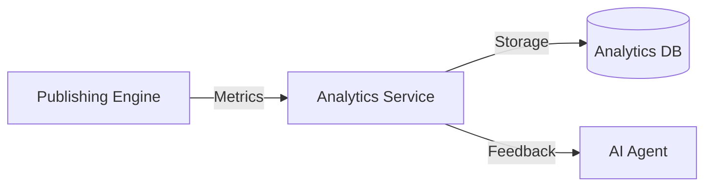

# PUBLISHING_ANALYTICS

## Purpose
The Publishing Analytics module provides comprehensive post-mortem performance data to inform future publishing strategies and AI learning.

## Key Metrics
- **Success Rate:** % of posts published successfully.
- **Failure Rate:** % of posts that failed, categorized by error type.
- **Latency:** Average time from queue to publish.
- **Platform Performance:** Engagement benchmarks per platform.
- **Content Performance:** Feedback loop metrics linked back to the content creation module.

## Workflow

