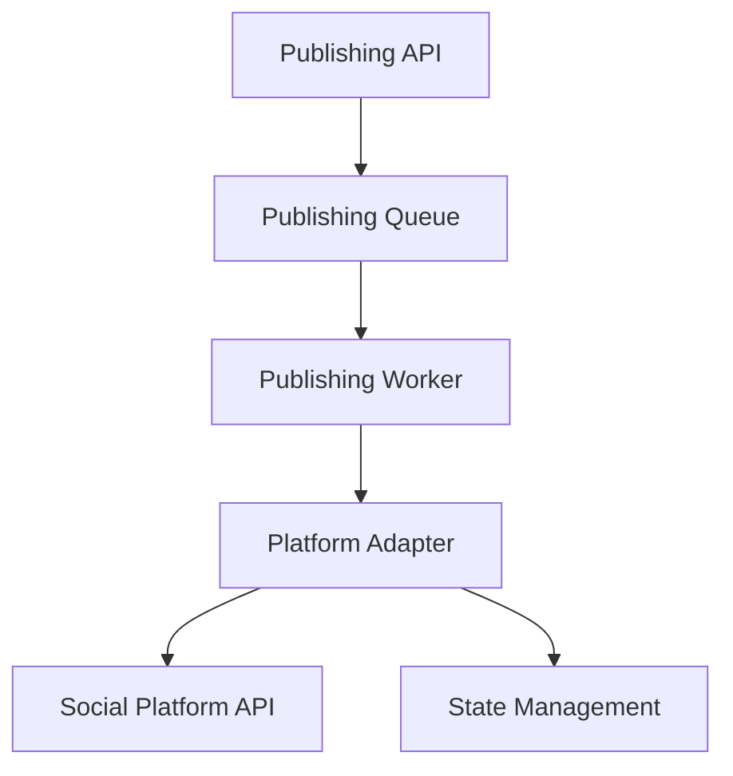

# Publishing Architecture

## 1. Purpose
To provide a reliable, scalable, and extensible system for publishing content to multiple social media platforms.

## 2. Architecture Diagram

## 3. Worker Services
Publishing workers are responsible for processing queued jobs, interacting with platform adapters, and managing post state transitions.

## 4. Platform Adapters
Each platform (TikTok, Instagram, etc.) has a dedicated adapter that implements the `PlatformAdapter` interface, handling authentication, post formatting, and error handling for that specific API.

## 5. Error Handling & Retries
The architecture utilizes a dedicated retry queue with exponential backoff for transient failures. Critical failures trigger notifications.

## 6. Performance Considerations
- Asynchronous processing ensures the API remains responsive.
- Concurrency limits prevent platform rate-limit violations.
