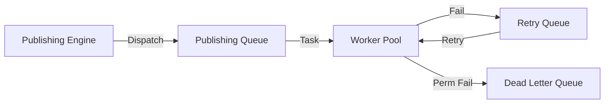

# QUEUE_MANAGEMENT

## Purpose
The Queue Management system ensures reliable, scalable, and high-throughput distribution of publishing tasks across available worker instances.

## Architecture
We utilize a multi-queue Redis-based architecture to handle different traffic profiles and priorities.

### Queue Types
| Queue Name | Priority | Purpose |
| :--- | :--- | :--- |
| `high_priority_publishing` | High | Immediate publishing requests |
| `scheduled_publishing` | Medium | Bulk scheduled tasks |
| `retry_queue` | Low | Transient failure recovery |
| `dead_letter_queue` | Lowest | Permanent failure storage/debugging |

## Worker Allocation
- **Dynamic Scaling:** Workers subscribe to specific queues based on load.
- **Concurrency Control:** Limits the number of concurrent connections per platform to remain within rate-limit constraints.

## Workflow

