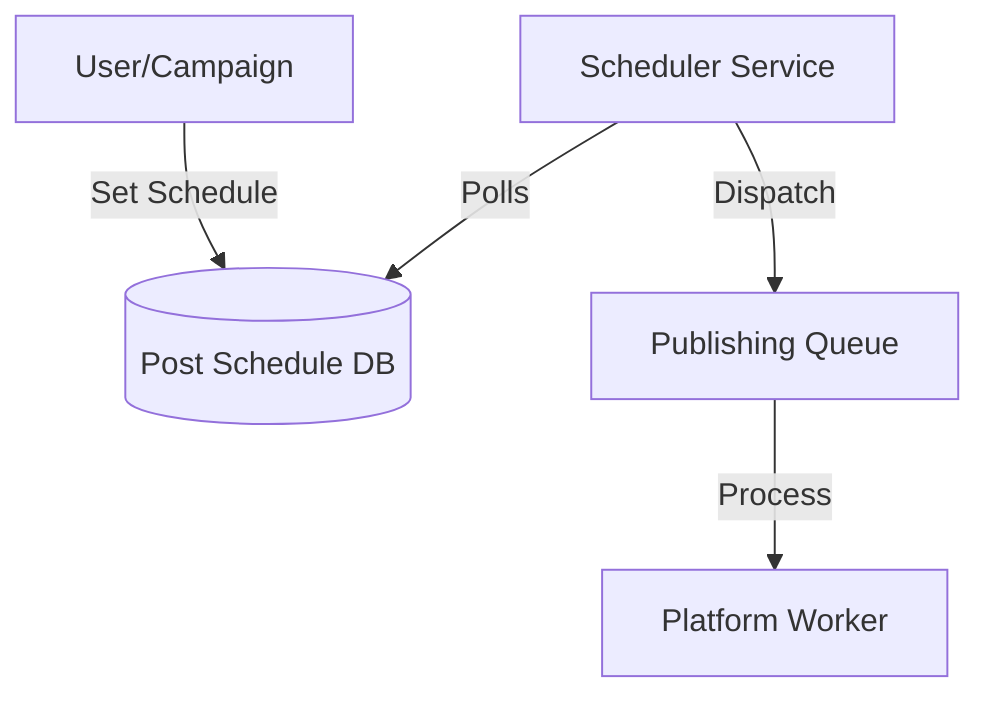

# SCHEDULER

## Purpose
The Scheduler manages the timing and execution sequence of all queued posts, ensuring content is published according to the defined timeline and optimized for peak engagement.

## Architecture
The scheduler operates as a centralized service that continuously polls the database for scheduled items and dispatches them to the `PublishingQueue`.

## Key Features
- **Timezone Handling:** All schedules are stored in UTC and converted to platform-specific timezones at dispatch.
- **Campaign Scheduling:** Allows grouping of multiple posts into a single campaign for coordinated releases.
- **Best-time Optimization:** Integrates with the `AnalyticsEngine` to suggest optimal posting times based on historical engagement data.
- **Conflict Resolution:** Prevents multiple posts from the same account from being scheduled too close together (enforcing user-defined buffer periods).

## Workflow

