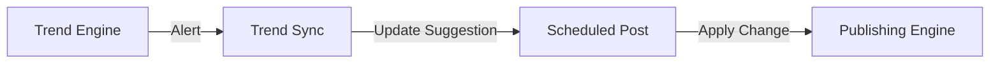

# TREND_SYNCHRONIZATION

## Purpose
This module ensures that published content is synchronized with current real-time trends to maintain relevance and boost organic reach.

## Key Functions
- **Trend Integration:** Subscribes to alerts from the `TrendEngine` and suggests modifications to scheduled posts.
- **Sound Association:** Matches trending audio/sounds to video content.
- **Regional Context:** Adjusts hashtags and content themes based on regional trends.

## Workflow

