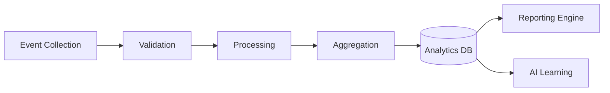

# Data Pipeline

## 1. Pipeline Overview

## 2. Stages
- **Event Collection**: Capturing events from frontend, backend, AI, and social platforms.
- **Validation**: Ensuring data conforms to expected schemas (Zod/Pydantic).
- **Processing**: Normalizing, anonymizing, and enriching data.
- **Aggregation**: Computing hourly/daily metrics for fast dashboard rendering.
- **Storage**: Persisting processed data in a time-series database.

## 3. Error Handling
- Data that fails validation is sent to a Dead Letter Queue (DLQ) for inspection and re-processing.
- Pipeline failures trigger high-priority alerts to the data engineering team.
