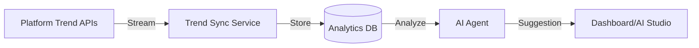

# TREND_ANALYTICS

## Purpose
Trend Analytics identifies emerging topics, hashtags, and viral content patterns to inform proactive content creation.

## Key Functions
- **Trend Discovery:** Real-time analysis of platform-specific trend feeds.
- **Virality Forecasting:** Using AI to predict the viral potential of topics.
- **Seasonality Analysis:** Identifying cyclical trends over time.

## Workflow

