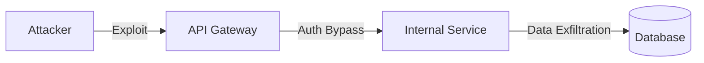

# Threat Model

## 1. STRIDE Analysis

| Threat | Description | Mitigation |
| :--- | :--- | :--- |
| **S**poofing | Impersonating a user or service | Strong Auth (MFA, JWT) |
| **T**ampering | Unauthorized modification of data | Digital signatures, Integrity checks |
| **R**epudiation | Denying an action | Audit logging, Immutable logs |
| **I**nformation Disclosure | Unauthorized data access | Encryption, Access control |
| **D**enial of Service | Making service unavailable | Rate limiting, Auto-scaling |
| **E**levation of Privilege | Gaining higher access | RBAC, Least privilege |

## 2. Attack Surfaces
*   Public API Gateway
*   User Authentication Endpoints
*   AI Model Inference Endpoints
*   Media Upload Endpoints
*   Admin Panel

## 3. Trust Boundaries
*   External Internet -> API Gateway (Untrusted -> Trusted)
*   API Gateway -> Internal Services (Trusted -> Trusted)
*   Internal Services -> Database/Storage (Trusted -> Trusted)

## 4. Attack Flow Diagram

